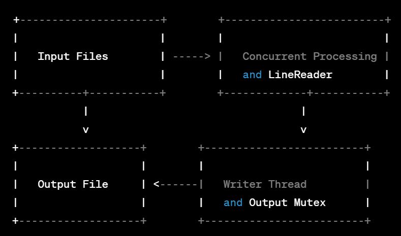

# Concurrent-File-Processing-System

# Problem Statement:

Our project addresses the challenge of concurrent file processing, crucial in various applications like log analysis, data transformation, and real-time processing. The primary goal is to efficiently process multiple files simultaneously while ensuring thread safety, optimal resource usage, and data integrity. This challenge becomes particularly pronounced in scenarios like log analysis, where logs from different servers need to be parsed, analyzed, and transformed concurrently.

The POPL angle in this problem lies in the concurrent file processing aspect. Rust and C++ both adhere to principles that address issues related to concurrent programming, such as data races, memory safety, and thread synchronization. The use of Rust and C++ enables us to leverage language features that contribute to the safety and correctness of concurrent code.

While concurrent file processing is a well-explored area, existing solutions might not always address the specific requirements of our project. Traditional concurrent programming languages like Java and C++ require explicit synchronization mechanisms, making them prone to issues like data races and deadlocks. Rust, with its ownership and borrowing system, provides a unique approach to prevent these issues, ensuring memory safety without sacrificing performance.

Our project combines the strengths of Rust and C++. Rust's ownership model enhances safety and concurrency, while C++ provides low-level control and flexibility.
Rust's ownership and borrowing system ensures memory safety and prevents data races, allowing for efficient concurrent file processing without sacrificing safety.
The use of asynchronous socket communication in C++ enhances the efficiency of client-server interactions, enabling the server to handle multiple clients simultaneously.
The adoption of the nlohmann/json library in C++ facilitates robust JSON parsing, ensuring a reliable mechanism for processing JSON-formatted files.
Our solution considers IPv6 support for enhanced network compatibility, providing a modern and versatile communication infrastructure.

# Software architecture:

Our solution follows a multithreaded architecture where multiple threads concurrently process input files and write the results to an output file. The software architecture involves:
LineReader Struct: Manages concurrent reading of lines from multiple files.
write_lines Function: Writes lines from LineReader to an output file using threads.
get_files_in_directory Function: Retrieves a list of file paths from a specified directory.
Main Function: Orchestrates the concurrent processing and measures elapsed time.
Reused and Developed Components:
We reused Rust's standard library for file I/O and threading. The use of Arc (Atomic Reference Counter) and Mutex for thread safety is a development based on Rust's ownership model.



Testing Component Placement:

Testing is primarily done locally, involving various input file scenarios to ensure the correctness of concurrent file processing.
Database Involvement:
No database is involved in the current implementation.
Software Architecture Explanation:
The LineReader struct manages the concurrent reading of lines from multiple input files, utilizing Rust's ownership model to prevent data races.
The write_lines function writes lines from the LineReader to an output file concurrently using threads, ensuring synchronization with a Mutex and Condvar.
The get_files_in_directory function retrieves a list of file paths from a specified directory, enabling dynamic input file discovery.
The main function orchestrates the entire process, measuring elapsed time and ensuring proper thread joining.

Challenges Faced:
Ensuring proper synchronization and thread safety in the presence of concurrent file access.
Coordinating multiple threads efficiently while managing shared resources.
Debugging potential deadlocks and optimizing the architecture for optimal performance.

# POPL Aspects:

**POPL Aspects Involved:**

1. **Ownership and Borrowing (LineReader):**
   - *Code Pointers:*
     - `LineReader` struct effectively manages ownership of files, preventing multiple threads from accessing them simultaneously.
   - *Explanation:*
     - Rust's ownership model ensures that each `LineReader` instance exclusively owns its associated files. This prevents data races and ensures safe concurrent file access.

2. **Mutex for Thread Safety (write_lines):**
   - *Code Pointers:*
     - `Mutex` is used in the `write_lines` function to ensure exclusive access to the output file.
   - *Explanation:*
     - The `Mutex` guarantees that only one thread can write to the output file at a time, preventing data corruption and adhering to Rust's principles of preventing data races.

3. **Arc for Shared Ownership (main):**
   - *Code Pointers:*
     - `Arc` is utilized to share ownership of the `LineReader` and `Condvar` between threads.
   - *Explanation:*
     - `Arc` allows multiple threads to share ownership of the `LineReader`, facilitating synchronized access and coordination during concurrent processing.

4. **Conditional Variable (write_lines):**
   - *Code Pointers:*
     - `Condvar` efficiently notifies waiting threads when a new line is written, avoiding busy waiting.
   - *Explanation:*
     - `Condvar` is essential for optimizing thread coordination, ensuring that threads efficiently wait for new lines without continuously checking for availability.

5. **Error Handling (main):**
   - *Code Pointers:*
     - Rust's `Result` type is extensively used for proper error propagation and handling.
   - *Explanation:*
     - The use of `Result` ensures that errors are properly managed and reported, aligning with Rust's emphasis on reliability and error handling.

# Potential for Future Work:

**Future Work:**

1. **Enhanced Error Handling and Recovery:**
   - **Description:**
     - Implement more advanced error handling mechanisms to enhance fault tolerance and recovery from unexpected failures during file processing.
   - **POPL Aspects:**
     - Explore additional Rust features or external libraries that can improve error detection and recovery strategies.

2. **Optimizations for Improved Throughput:**
   - **Description:**
     - Investigate and implement optimizations to further enhance the system's throughput, considering factors like file chunking or parallelized processing techniques.
   - **POPL Aspects:**
     - Leverage Rust's ownership and borrowing model to optimize data access and minimize contention during concurrent file processing.

3. **Exploration of Advanced Concurrency Patterns:**
   - **Description:**
     - Explore and implement advanced concurrency patterns provided by Rust, such as async/await or more sophisticated threading models, to potentially improve efficiency.
   - **POPL Aspects:**
     - Examine how advanced concurrency patterns align with Rust's ownership and borrowing principles for better code safety.

4. **Extended Support for Different File Formats:**
   - **Description:**
     - Extend the system's capabilities to support a broader range of file formats, including structured data formats like JSON or CSV, enhancing versatility.
   - **POPL Aspects:**
     - Consider how Rust's ownership model can be adapted to handle more complex data structures commonly found in structured file formats.

# Compilation and Execution Instructions

## For C++

Navigate to the "code_orig" directory:

```bash
cd code_orig
```
For c++
```
g++ -std=c++17 main.cpp
./a.out
```

For rust
```
rustc main.rs
./main
```

Results would be output in the parent directory


# Results:

Found in the resuults folder


